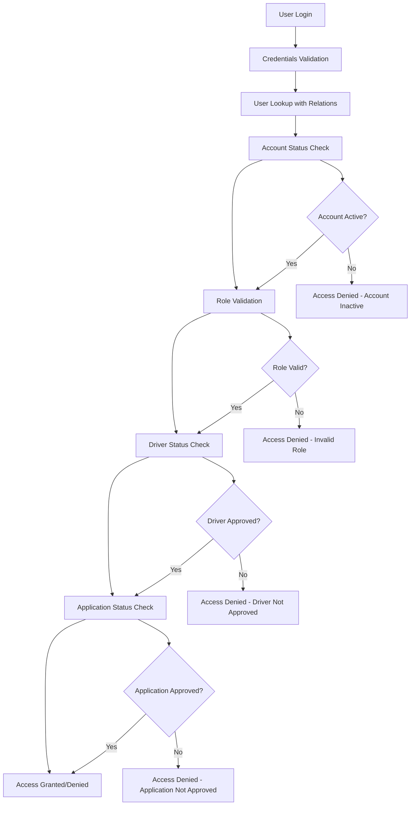

# Role-Based Authentication Implementation

## Overview

This document outlines the implementation of strict role-based authentication that completely separates driver and customer access in the Speedy Van system. The system ensures that:

1. **Customers can only access the customer portal** - even if they have a pending driver application
2. **Drivers can only access the driver portal** - only after admin approval of their application
3. **Admins maintain full control** - over driver application approval and user access
4. **Clear separation of concerns** - preventing role confusion and unauthorized access

## Key Features

### 🔐 Strict Role Separation
- **Customer Role**: Access limited to customer portal only
- **Driver Role**: Access limited to driver portal only (after approval)
- **Admin Role**: Full system access with role-based permissions

### 🚫 Access Control Enforcement
- **Middleware Protection**: Route-level access control
- **Authentication Checks**: Session-level role validation
- **Status Verification**: Driver approval status verification
- **Application State**: Driver application status validation

### 🛡️ Security Measures
- **Account Inactivation**: Automatic deactivation of rejected applications
- **Session Validation**: Real-time role and status verification
- **Audit Logging**: Complete audit trail of access attempts
- **Error Handling**: User-friendly error messages with clear guidance

## System Architecture

### Authentication Flow



### Database Schema

The system uses the following key models and relationships:

```prisma
model User {
  id                String   @id @default(cuid())
  email             String   @unique
  role              Role     @default(customer)
  isActive          Boolean  @default(true)
  driver            Driver?
  driverApplication DriverApplication?
}

model Driver {
  id                String       @id @default(cuid())
  userId            String       @unique
  onboardingStatus  DriverStatus @default(applied)
  approvedAt        DateTime?
  user              User         @relation(fields: [userId], references: [id])
}

model DriverApplication {
  id        String                  @id @default(cuid())
  email     String                  @unique
  status    DriverApplicationStatus @default(pending)
  userId    String?                 @unique
  user      User?                   @relation(fields: [userId], references: [id])
}

enum Role {
  admin
  driver
  customer
}

enum DriverStatus {
  applied
  docs_pending
  in_review
  approved
  suspended
  removed
}

enum DriverApplicationStatus {
  pending
  approved
  rejected
  under_review
  requires_additional_info
}
```

## Implementation Details

### 1. Authentication System (`/lib/auth.ts`)

#### Enhanced User Lookup
```typescript
const user = await prisma.user.findUnique({
  where: { email: creds.email },
  include: {
    driver: {
      include: {
        driverApplication: true
      }
    },
    driverApplication: true
  }
});
```

#### Role-Based Access Control
```typescript
// For drivers, check if they have been approved
if (user.role === 'driver') {
  if (!user.driver || user.driver.onboardingStatus !== 'approved') {
    return null; // Access denied
  }
  
  // Check if driver application is approved
  if (user.driverApplication && user.driverApplication.status !== 'approved') {
    return null; // Access denied
  }
}

// For customers, ensure they don't have pending driver applications
if (user.role === 'customer') {
  if (user.driverApplication && user.driverApplication.status === 'pending') {
    return null; // Access denied
  }
}
```

#### Enhanced Session Data
```typescript
const userData = {
  id: user.id,
  email: user.email,
  name: user.name ?? "",
  role: user.role,
  adminRole: (user as any).adminRole ?? null,
  driverId: user.driver?.id ?? null,
  driverStatus: user.driver?.onboardingStatus ?? null,
  applicationStatus: user.driverApplication?.status ?? null
};
```

### 2. Middleware Protection (`/middleware.ts`)

#### Route Protection
```typescript
const protectedRoutes = {
  '/admin': ['admin'],
  '/driver': ['driver'],
  '/customer': ['customer'],
  '/api/admin': ['admin'],
  '/api/driver': ['driver'],
  '/api/customer': ['customer'],
};
```

#### Access Control Logic
```typescript
// Check if driver is approved
if (!driverId || driverStatus !== 'approved') {
  const errorUrl = new URL('/auth/error', request.url);
  errorUrl.searchParams.set('error', 'DriverNotApproved');
  return NextResponse.redirect(errorUrl);
}

// Check if driver application is approved
if (applicationStatus && applicationStatus !== 'approved') {
  const errorUrl = new URL('/auth/error', request.url);
  errorUrl.searchParams.set('error', 'ApplicationNotApproved');
  return NextResponse.redirect(errorUrl);
}
```

### 3. Error Handling (`/app/auth/error/page.tsx`)

#### Comprehensive Error Messages
- **AccountInactive**: Account deactivated due to rejection or admin action
- **InsufficientPermissions**: User lacks required role permissions
- **DriverAccessRequired**: Non-driver attempting to access driver portal
- **DriverNotApproved**: Driver not yet approved by admin
- **ApplicationNotApproved**: Driver application rejected or under review
- **CustomerAccessRequired**: Non-customer attempting to access customer portal
- **PendingDriverApplication**: Customer with pending driver application

#### Actionable Solutions
Each error provides specific actions users can take:
- Apply to be a driver
- Contact support
- Check application status
- Navigate to appropriate portal
- Return to home page

## Driver Application Process

### 1. Application Submission
```typescript
// Create user account (inactive until approved)
const user = await prisma.user.create({
  data: {
    name: `${firstName} ${lastName}`,
    email,
    password: hashedPassword,
    role: 'driver',
    isActive: false, // Will be activated when admin approves
  },
});
```

### 2. Admin Approval
```typescript
// Update application status
await tx.driverApplication.update({
  where: { id: applicationId },
  data: {
    status: 'approved',
    reviewedAt: new Date(),
    reviewedBy: session.user.id,
    reviewNotes: reason || 'Approved by admin',
  }
});

// Activate user account
await tx.user.update({
  where: { id: application.user.id },
  data: {
    isActive: true,
    role: 'driver',
  }
});

// Create driver record
const driver = await tx.driver.create({
  data: {
    userId: application.user.id,
    onboardingStatus: 'approved',
    basePostcode: application.postcode,
    vehicleType: 'medium_van',
    status: 'active',
    approvedAt: new Date(),
  }
});
```

### 3. Admin Rejection
```typescript
// Update application status
await prisma.driverApplication.update({
  where: { id: applicationId },
  data: {
    status: 'rejected',
    reviewedAt: new Date(),
    reviewedBy: session.user.id,
    reviewNotes: reason || 'Rejected by admin',
  }
});

// Deactivate user account
if (application.user) {
  await prisma.user.update({
    where: { id: application.user.id },
    data: {
      isActive: false,
    }
  });
}
```

## Security Features

### 1. Account Inactivation
- Rejected driver applications automatically deactivate user accounts
- Pending applications prevent access to customer portal
- Admin can manually deactivate accounts for security reasons

### 2. Session Validation
- Real-time verification of user status and role
- Automatic session invalidation on status changes
- Comprehensive audit logging of access attempts

### 3. Route Protection
- Middleware-level access control
- API endpoint protection
- Client-side route guards

## User Experience

### 1. Clear Error Messages
Users receive specific, actionable error messages explaining:
- Why access was denied
- What they need to do next
- How to contact support

### 2. Guided Actions
Each error provides relevant action buttons:
- Apply to be a driver
- Check application status
- Contact support
- Navigate to appropriate portal

### 3. Status Transparency
Users can always see:
- Their current application status
- What they need to do next
- Expected timeline for approval

## Testing Scenarios

### 1. Customer Access Control
- ✅ Customer can access customer portal
- ❌ Customer cannot access driver portal
- ❌ Customer with pending driver application cannot access customer portal
- ❌ Customer with rejected driver application cannot access driver portal

### 2. Driver Access Control
- ❌ Driver cannot access driver portal before approval
- ❌ Driver cannot access customer portal after approval
- ✅ Driver can access driver portal after approval
- ❌ Driver with rejected application cannot access driver portal

### 3. Admin Access Control
- ✅ Admin can access admin portal
- ✅ Admin can approve/reject driver applications
- ✅ Admin can manage user accounts
- ❌ Non-admin cannot access admin portal

### 4. Application State Transitions
- ✅ Pending → Approved: User becomes active driver
- ✅ Pending → Rejected: User account deactivated
- ✅ Approved → Rejected: Driver access revoked
- ✅ Rejected → Approved: User account reactivated

## Monitoring and Maintenance

### 1. Audit Logging
All authentication events are logged:
- Login attempts (success/failure)
- Role changes
- Access denials
- Application status changes

### 2. Error Tracking
Comprehensive error tracking for:
- Authentication failures
- Access control violations
- Middleware errors
- Database connection issues

### 3. Performance Monitoring
- Authentication response times
- Database query performance
- Middleware execution time
- Session management efficiency

## Future Enhancements

### 1. Advanced Role Management
- Role hierarchies
- Permission-based access control
- Dynamic role assignment
- Role expiration

### 2. Enhanced Security
- Multi-factor authentication
- IP-based access control
- Device fingerprinting
- Suspicious activity detection

### 3. User Experience
- Application status dashboard
- Real-time notifications
- Progress tracking
- Self-service account management

## Conclusion

This implementation provides a robust, secure, and user-friendly role-based authentication system that:

1. **Completely separates** driver and customer access
2. **Enforces strict controls** at multiple levels
3. **Provides clear guidance** to users when access is denied
4. **Maintains security** through comprehensive validation
5. **Supports scalability** for future enhancements

The system ensures that users can only access the appropriate portals based on their approved role and application status, while providing administrators with full control over the approval process and user access management.
